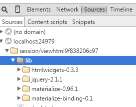

# materializeR | materialize for R

[materialize](http://materializecss.com) implements Google's Material Design in a CSS/JS/HTML framework.  It is built by a talented [team of Carnegie Mellon Students](http://materializecss.com/about.html#team) and has amassed **> 8,000 stars** in less than half a year.  Although I have been watching it closely since its release, [Alex Bresler](http://asbcllc.com/) deserves the credit for motivating me to assemble this little `htmlwidget`.


### not a normal htmlwidget
Since `materialize` is a very full-featured and complete framework, the traditional full wrapping of an `htmlwidget` is nearly impossible.  This `htmlwidget` seeks to provide a thin convenience layer primarily aimed to ease dependency injection for the required Javascript and CSS.  What this means is that **you will need to know some `HTML/JS/CSS`** or copy/paste well to make it work.  Also, [`htmltools`](http://github.com/rstudio/htmltools) and/or [`Shiny`](rstudio.com/shiny) are/is a highly recommended companion to `materializeR`.

### install and use
`materializeR` is not on CRAN, so install with `devtools::install_github`.

```r
devtools::install_github("timelyportfolio/materializeR")
```

There is just one function `materialize` to make it work.  When you type it, you might be disappointed, but behind that blank screen is a world of potential backed by all the power of `materialize` and `jquery`.




### thanks to materialize team
Thanks so much to the generous and talented [team](http://materializecss.com/about.html#team) behind `materialize`.

- Alvin Wang
- Alan Chang
- Alex Mark
- Kevin Louie
